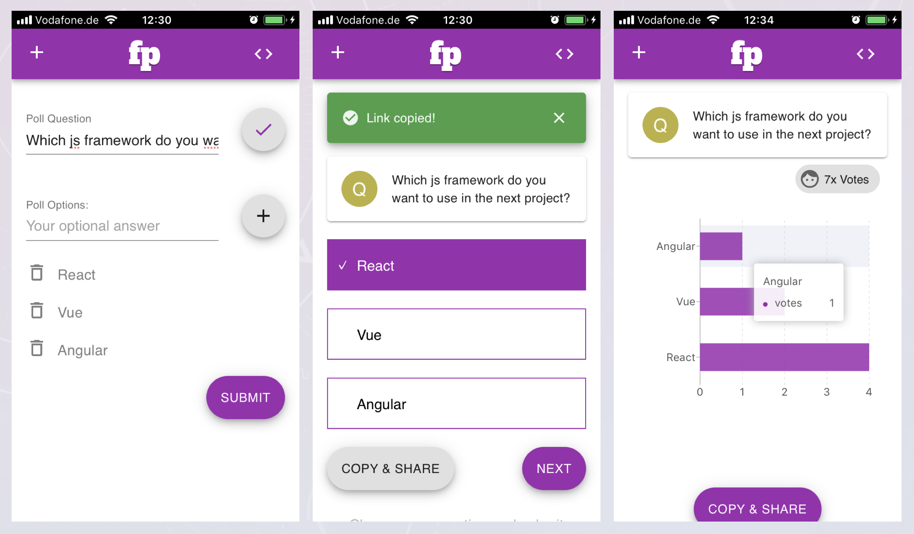

# FirePoll
A real-time responsive voting app with react.js + redux + firebase, UX powered by React Material UI.



### Prerequisites
create a new project on FireBase and get the API credential to establish the connection with firebase.


If you have no experience with `firebase`, please read [here](https://firebase.google.com/docs/web/setup)

### Installing

To run the app locally, the following credentials need to be added to `.env`
```bash
## rename .env.dist to .env, then add the credential which you got from firebase console.
REACT_APP_FIREBASE_KEY=""
REACT_APP_FIREBASE_DOMAIN=""
REACT_APP_FIREBASE_DATABASE=""
REACT_APP_FIREBASE_PROJECT_ID=""
REACT_APP_FIREBASE_STORAGE_BUCKET=""
REACT_APP_FIREBASE_SENDER_ID=""
```
If you have no experience with `firebase`, please read [here](https://firebase.google.com/docs/web/setup)

## start
    yarn install
    yarn start
    
+
## Deployment

The live demo is hosted with free service on [netlify.com](https://www.netlify.com)


## Bugs
- votePage: vote still possible, if no option selected ✔︎

    
    


## License
MIT
