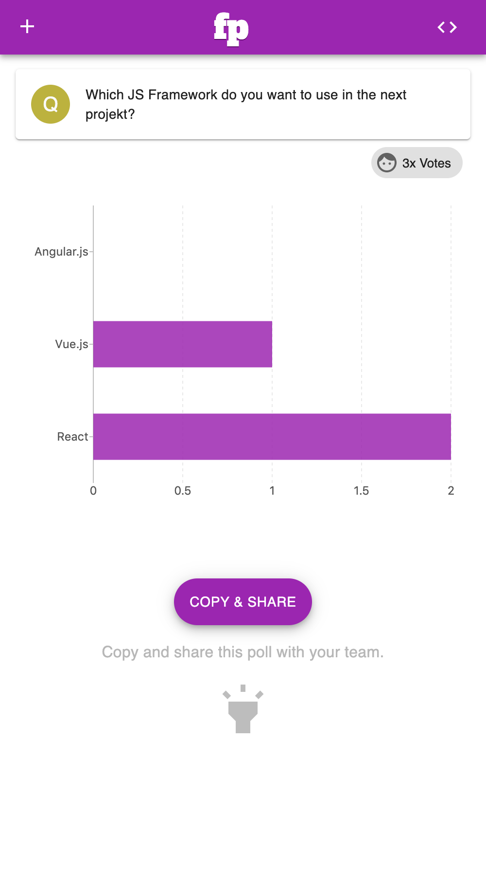

# FirePoll
A realtime voting app with react.js + redux + firebase

(🔥,✔︎)
## Requirement for MVP
 1. Question Form Page
 2. Vote Form page
 3. Chart Page(real time)
 4. Chart should be reactive and realtime
 5. necessary error handling

## Todos
- use State Manager: Redux 🔥
- add unit tests 🔥

- create pages
    - install router ✔︎
    - integrate router dom in app and create pages ✔︎
- build the work flow ✔︎
    1. user adds a new question ✔︎
    2. user is redirected to the next page: vote form page ✔︎
    3. user gives a vote to the question ✔︎
    4. user is redirected to the next page:  charts page ✔︎
   
- customize the navigation header
    - just have one link "create new poll(link to home)" ✔︎
    
- make the views mobile friendly
    - question ✔︎
    - vote ✔︎
    - chart ✔︎

## Bugs
- votePage: vote still possible, if no option selected ✔︎

    
    
